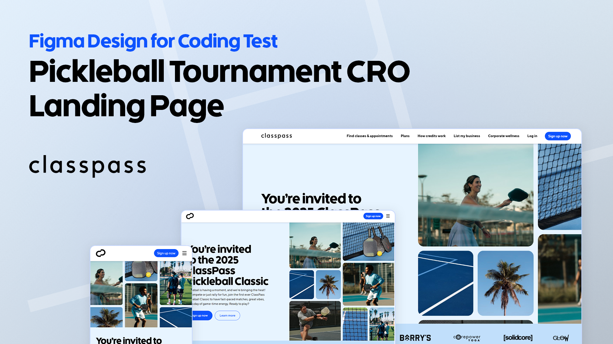
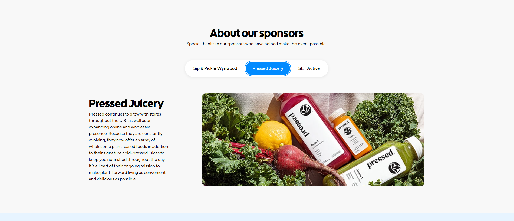
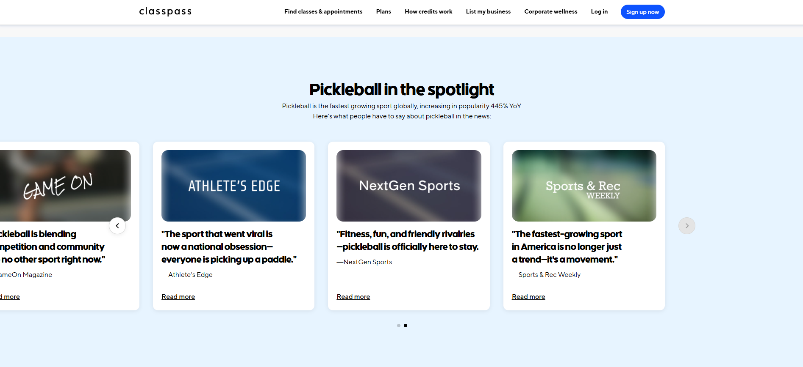

# Figma Design for Coding Test | Pickleball Tournament



## Project Overview

A responsive landing page developed as a technical challenge, converting a Figma design into a fully functional page using only HTML, CSS, and vanilla JavaScript.

## 🚀 Live Demo

[View Live Website](https://classpass-pickleball.netlify.app/)

## 🌟 Key Features

### Technical Approach

- **Pure Frontend Implementation**: No external libraries or frameworks
- **ITCSS Styling Approach**: Leveraging Hubspot's methodology for scalable CSS
- **Responsive Design**: Fully responsive, with thoughtful layout adaptations
- **Accessibility First**: Implemented ARIA labels and a11y best practices

### 🔍 Accessibility Features

- Comprehensive ARIA labeling
- Semantic HTML structure
- Keyboard navigation support
- Screen reader optimization

### Design System ([view the mini DS Reference](https://classpass-pickleball.netlify.app/pages/system-design))


Used design tokens into a strategic tool for consistency, scalability, and efficiency. By centralizing design decisions, we create a flexible framework that enables rapid iteration, maintains visual harmony, and provides a single source of truth for designers and developers.

| Category          | Variables                                         | Benefits                                                                                              |
| ----------------- | ------------------------------------------------- | ----------------------------------------------------------------------------------------------------- |
| **Color Palette** | `--color-primary-brand`, `--color-gray-*`         | - Consistent branding<br>- Easy global color updates<br>- OKLCH color model for perceptual uniformity |
| **Spacing**       | `--spacing-*`                                     | - Consistent rhythm<br>- Predictable layout<br>- Rapid design iterations                              |
| **Typography**    | `--font-sans`, `--font-title`<br>`--text-*` sizes | - Typographic hierarchy<br>- Responsive typography<br>- Font stack fallbacks                          |
| **Border Radius** | `--border-radius-*`                               | - Consistent component corners<br>- Design system cohesion                                            |
| **Shadows**       | `--shadow-base`, `--shadow-lg`                    | - Depth and hierarchy<br>- Consistent elevation effects                                               |

### Besides that:

- Custom CSS variables for consistent theming
- Utility classes alongside BEM methodology
- Grid system inspired by bootstrap for easy collaboration
- Component-level design system with reusable styles

## 🧩 JavaScript Components

### Tabs Component: Accessible and Keyboard-Friendly



#### Key Features

- Full keyboard navigation support
- ARIA attribute management
- Dynamic tab and panel state handling
- Circular tab navigation (wraps around edges)
- Automatic initialization for multiple tab groups

#### Accessibility Achievements

- Supports screen readers
- Implements keyboard navigation patterns
- Manages focus and selection states
- Ensures semantic HTML structure
- Provides intuitive keyboard interactions

### Carousel Component: Dynamic and Responsive Navigation



#### Key Features

- Responsive design with adaptive items per page
- Support for both desktop (3 items) and mobile (1 item) layouts -> can be customized for more breakpoints in the future
- Advanced pagination and navigation controls
- Touch and mouse swipe interactions
- Dynamic offset calculations
- Automatic breakpoint handling

#### Technical Highlights

- Uses CSS variables for smooth translations
- Intelligent page and slide tracking
- Comprehensive pagination management
- Handles edge cases in multi-item layouts
- Responsive resize event listener

## 💻 Technologies Used

- HTML5
- CSS3 (ITCSS Approach)
- Vanilla JavaScript
- Netlify (Hosting)

## 🌐 Browser Compatibility

- Chrome (Latest Version)
- Firefox (Latest Version)

## 📱 Responsive Approach

- Mobile-first design
- Fluid layouts
- Container CSS

## 📦 How to run the project

```bash
# Clone the repository
git clone https://github.com/odanilo/cro-landing-page

# Open the project
cd cro-landing-page

# No additional dependencies required
# Open index.html in your browser
```

## 📄 License

Distributed under the MIT License.
